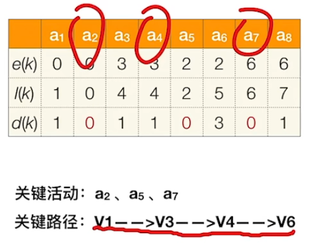

# 图
## 图的表示形式

对于这样一个图，常见的表示形式有如下两种：
### 邻接矩阵(adjacent matrix)

访问$|V|$个顶点需要$O(|V|)$的时间
查找每个顶点的邻接点都需要$O(|V|)$的时间，而总共有$|V|$个顶点，所以访问所有边的时间复杂度$=O(|V|^2)$
总的时间复杂度$=O(|V|)+O(|V|^2)=O(|V|^2)$
*缺点：矩阵稀疏时很浪费空间*
*代码实现：*
```cpp
typedef int Vertex;
class Graph{
  public:
    Graph(int num){
        num_vertices = num;
        edge = new int*[num_vertices];
        vertexTable = new Vertex[num_vertices];
    }
    ~Graph(){ delete[]vertexTable; delete[]edge; }
  private:
    int num_vertices; //顶点数量
    int **edge;   //邻接矩阵，表示点与点之间是否存在边，有权图中可以当作权值
    Vertex *vertexTable;   //顶点表
};
```

### 邻接表(adjacent list)

访问各个顶点需要$O(|V|)$的时间
有向图查找各个顶点的邻接点共需要$O(|E|)$的时间,无向图则翻倍
总的时间复杂度$=O(|V|+|E|)$
*缺点：不方便找入边和计算入度*
*代码实现：*
```cpp
typedef struct Adjacent_node {
    int dest;  //此邻接(目标)顶点在顶点表中的下标,不能直接使用顶点类，否则会死循环
    int cost;  //顶点与此邻接顶点形成的边上的权值
    Adjacent_node *next;   //下一个邻接顶点
    Adjacent_node(int destination = -1, int weight = 1) :dest(destination), cost(weight), next(nullptr) {}
} Edge;   //主流命名是“Edge”

struct Vertex {
    int data;    //顶点数据域
    Adjacent_node *first;   //随便一个邻接结点作为边链表头结点
    Vertex() { data = 0;  first = new Adjacent_node(); }
};

class Graph{
  public:
    Graph(int num){
        num_vertices = num;
        num_edges= 0; 
        vertexTable = new Vertex[num_vertices];
    }
    ~Graph(){ delete[]vertexTable; }
  private:
    int num_edges,num_vertices;  //顶点数量、边数量
    Vertex *vertexTable;   //顶点表
};
```
## 图的遍历
### 广度优先遍历(BFS)

添加访问标记数组，可以遍历非连通图
```cpp
bool visited[MaxNumVertex];   //访问标记数组

void BFSTraverse(Graph G) {   //对图G进行广度优先遍历
    for (int i=1; i<=G.num_vertices; ++i) {
        visited[i] = false;   //访问标记数组初始化
    InitQueue(Q);   //初始化辅助队列Q
    for(int i=1; i<=G.num_vertices; ++i)  //从1号顶点开始遍历，遍历过就标记
        if(!visited[i])   //对每个连通分量调用一次BFS,防止多个连通分量之间不连通，永远无法遍历到
            BFS(G,i);   //vi未访问过，从vi开始BFS
    }
}
//广度优先遍历
void BFS(Graph G,int v) {//从顶点v出发，广度优先遍历图G
    visit(v);     //访问初始顶点v
    visited[v]=TRUE;    //对v做已访问标记
    Enqueue(Q,v);    //顶点v入队列Q
    while (!isEmpty(Q)) {
        DeQueue(Q,v);     //顶点v出队列
        for(w=G.FirstNeighbor(v) ; w>=0 ; w=G.NextNeighbor(v,w)){  //检测v所有邻接点
            if(!visited[w]){      //w为v的尚未访问的邻接顶点
                visit(w);  //访问顶点w
                visited[w] = true;  //对w做已访问标记
                EnQueue(Q,w);  //顶点w入队列
            }
        }
    }
}
```
#### 广度优先生成树
连通图按广度优先遍历顺序生成一颗树，若图不连通，则可生成森林

### 深度优先遍历(DFS)
```cpp
bool visited[MaxNumVertex];   //访问标记数组

void DFSTraverse(Graph G){   //对图G进行深度优先遍历
    for(int v=1; v<=G.num_vertices; ++v)
        visited[v]=false;  //初始化已访问标记数据
    for(int v=1; v<=G.num_vertices; ++v)
        if(!visited[v])
            DFS(G,v);
}  //这个函数同样是为了防止出现非连通图

void DFS(Graph G,int v){   //从顶点v出发，深度优先遍历图G
    visit(v);   //访问顶点v
    visited[v] = true;  //设已访问标记
    for(int w=G.FirstNeighbor(v); w>=0; w=G.NextNeighor(v,w))
        if(!visited[w]){   // w为v的尚未访问的邻接顶点
            DFS(G,w);
        }
}
```
对上图进行深度优先遍历，若从2出发，则序列为: 2，1，5，6，3，4，7，8，9，10，11
空间复杂度取决于递归深度，最坏为$O(|V|)$，最好为$O(2)$，最好的情况即其他点围着一个起点。

同一个图的邻接矩阵表示方式*唯一*，因此深度优先遍历序列*唯一*，深度优先生成树也*唯一*。
同一个图邻接表表示方式*不唯一*，因此深度优先遍历序列*不唯一*，深度优先生成树也*不唯一*。
#### 深度优先生成树
定义同BFS，非连通图时生成森林

### 阶段总结
#### 无向图
对无向图进行BFS/DFS遍历，调用BFS/DFS函数的次数=连通分量数
对于连通图，只需调用1次BFS/DFS
#### 有向图

#### 思维导图


## 最小生成树(最小代价树)(Minimum-Spanning-Tree,MST)

+ 非连通图不会产生生成树，只产生生成森林
+ 如果一个连通图本身就是一棵树，则其最小生成树就是它本身
+ 最小生成树*可能不唯一*，但总权值唯一且最小
+ $边数 = 顶点树 - 1$
+ 所以研究对象为**带权连通无向图**

### Prim算法(普里姆)
+ **从某一个顶点开始构建生成树**
+ **每次将靠近*当前生成树*的代价最小的新顶点纳入，直到所有顶点都纳入为止。**

<figure>图中从农场开始，依次是农场、电站、P城、学校、矿场或渔村......</figure>

#### 算法实现

+ 对于这样一个图，准备两个数组，`isJoin`和`lowCost`，初始化如下图
+ 每轮结束后检测*新结点*有没有*带来更小的边*，更新*还没加入生成树*的顶点的`lowCost`，然后接着选择cost最小的新顶点加入

+ 从$V_0$开始，总共需要$n-1$轮处理
+ 每一轮处理:循环遍历所有结点，找到`lowCost`最低的且还没加入树的顶点。
+ 再次循环遍历，更新还没加入的各个顶点的`lowCost`值，每轮$O(2n)$
+ **总时间复杂度为$(n-1)O(n) = O(|V|^2)$，适合用于边稠密的图**

### Kruskal算法(克鲁斯卡尔)
+ **每次选择一条权值最小的边，使这条边的两头连通(若两头已经连通可以互相到达，就不选，去选次小的边)**
+ **直到所有结点都连通**
#### 算法实现
+ 初始︰将各条边按权值排序


+ 共执行$E$轮，每轮判断两个顶点是否属于同一集合，需要$O(log_2E)$
+ **总时间复杂度$O(|E|log_2|E|)$，适合用于边稀疏的图**
+ 可以带负权
## 最短路径问题
### 单源最短路径
#### BFS算法(无权图)
+ 无权图可以看作权都为1的有权图
+ 广度优先生成树的深度其实就是最短路径长度
+ 在广度优先遍历的基础上记录 路径长度`d`和前驱顶点`path`
(`DeQueue(Q,u)`是将队头元素出队并赋值给`u`)

根据`path`数组可以推出最短路线：

#### Dijkstra算法(带权图、无权图、有环图)

+ 之前未找到最短路径的顶点中，`dist`最小的顶点本轮可以找到最短路径，将`final[] = true`
+ 尝试经过*新加入的顶点*到*未加入点*，若新的带权路径小于`dist`中的值，则更新`dist`、`path`数组
+ 如此循环，直到`final`数组全部变成`true`

##### 算法实现

这里的`dist`数组的作用类似$Prim$算法中的`lowCost`数组，因此时间复杂度与之相同。
##### 注意
+ $Dijkstra$算法不适用于*带负权*的带权图
+ 原因："`dist`最小的点就找到了最短路径" 这一判断是基于**选择其他路径之后也只会更大**的事实，若有负权，则这一事实不成立
+ 带负权可以使用$Bellman-Ford$算法
### 各顶点间的最短路径
一个显然的思路是：轮流以每一个顶点作为源点，重复执行$Dijkstra$算法$n$次，时间复杂度为$O(n^3)$

下面介绍一种形式上更直接的$Floyd$算法，虽然时间复杂度也是$O(n^3)$
#### Floyd算法(带(负)权图、无权图)
带有*负权回路*还是不能解决
##### 思路

##### 实现逻辑

+ 不断更新两个状态矩阵，右上角标代表第几轮
+ 若通过第$k$个中转点可以减少路径，则更新矩阵
###### 一个更复杂的例子
*状态1*

*状态2*

......后面同理
##### 代码展示
```cpp
//......准备工作，根据图的信息初始化矩阵A和path(如上图)
for (int k=0 ; k<n; k++) {  //考虑以V_k作为中转点
    for (int i=0; i<n; i++) {  //遍历整个矩阵，i为行号，j为列号
        for (int j=0; j<n; j++) {
            if (A[i][j] > A[i][k] + A[k][j]) {//以 V_k为中转点的路径更短
                A[i][j] = A[i][k] + A[k][j];  //更新最短路径长度
                path[i][j] = k;  //中转点
            }
        }
    }
}
```
##### 复原完整路线
通过递归填充两点间的路径

### 阶段总结


## AOV->拓扑排序
### 定义
在图论中，由一个有向无环图的顶点组成的序列，当且仅当满足下列条件时，称为该图的一个拓扑排序:
+ 每个顶点出现且只出现一次。
+ 若顶点A在序列中排在顶点B的前面，则在图中不存在从顶点B到顶点A的路径。
+ 将各个顶点(代表各个活动)排列成一个线性有序的序列，使得AOV网络中所有应存在的前驱和后继关系都能得到满足。

或定义为︰拓扑排序是对有向无环图的顶点的一种排序，它使得若存在一条从顶点A到顶点B的路径，则在排序中顶点B出现在顶点A的后面。每个AOV网都有一个或多个拓扑排序序列。

### 实现
+ 从AOV网中选择一个没有前驱(入度为0)的顶点并输出。
+ 从网中删除该顶点和所有以它为起点的有向边。
+ 如此重复，直到当前的AOV网为空或当前网中不存在无前驱的顶点为止。
+ 若存在**有向回路**，则**不存在**拓扑排序序列。

```cpp
bool Topologicalsort (Graph G) {
    InitStack(S); //初始化栈，存储入度为0的顶点，队列也行，只是入度都为0时，删除顺序不同
    for (int i=0; i<G.num_vertices; i++) {
        if (indegree[i]==0)
            Push(s,i);  //将所有入度为0的顶点进栈
    }
    int count = 0;   //计数，记录当前已经输出的顶点数
    while (!IsEmpty(S)) {  //栈不空，则存在入度为0的顶点
        Pop(s,i);  //栈顶元素出栈并存入变量i
        print[count++] = i;  //输出顶点i
        for (auto p=G.vertices[i].first; p!=nullptr; p=p->next){
            int v = p->dest;//将所有i指向的顶点的入度减1，并且将入度减为0的顶点压入栈S
            if(!(--indegree[v]))
                Push(S,v) ;  //若入度减1后为0，则入栈
        }
    }
    if(count < G.num_vertices)
        return false;  //排序失败，说明有向图中有回路
    else
        return true;  //拓扑排序成功
}
```

### 逆拓扑排序
+ 从AOV网中选择一个没有后继（出度为0)的顶点并输出。
+ 从网中删除该顶点和所有以它为终点的有向边。
+ 如此重复，直到当前的AOV网为空。

#### DFS实现

```cpp
void DFSTraverse(Graph G){ //对图G进行深度优先遍历
    for (int v=0; v<G.num_vertices; ++v)
        visited[v] = false;  //初始化已访问标记数据
    for(int v=0; v<G.num_vertices; ++v)  //本代码中是从v=0开始遍历
        if (!visited[v])
            DFS(G,v);
}

void DFS (Graph G,int v) {//从顶点v出发，深度优先遍历图G
    visited[v] = true;//设已访问标记
    for(w=G.FirstNeighbor(v) ;w>=0; w=G.NextNeighor(v,w))
        if (!visited[w]) {// w为u的尚未访问的邻接顶点
            DFS(G,w);
        }
    print(v);//输出顶点
}
```
*思考*: 如果存在回路，则不存在逆拓扑排序序列，如何判断回路?
## AOE->关键路径
+ 在带权有向图中，以顶点表示事件，以有向边表示活动，以边上的权值表示完成该活动的开销(如完成活动所需的时间)，称之为用边表示活动的网络，简称AOE网(Activity On Edge NetWork)

+ AOE网具有以下两个性质:
    + 只有在某顶点所代表的事件发生后，从该顶点出发的各有向边所代表的活动才能开始;
    + 只有在进入某顶点的各有向边所代表的活动都已结束时，该顶点所代表的事件才能发生。另外，有些活动是**可以并行进行**的


+ 从源点到汇点的有向路径可能有多条，所有路径中，具有最大路径长度的路径称为**关键路径**，而把关键路径上的活动称为**关键活动**
+ 完成整个工程的最短时间就是关键路径的长度，若关键活动不能按时完成，则整个工程的完成时间就会延长。
### 实现思路
+ 求所有事件的最早发生时间$Ve()$
求所有事件的最迟发生时间$Vl()$
求所有活动的最早发生时间$e()$，指该活动弧的起点所表示的事件的最早发生时间
求所有活动的最迟发生时间$l()$，指该活动弧的终点所表示事件的最迟发生时间与该活动所需时间之差。
求所有活动的时间余量$d()=l()-e()$，$d=0$的活动就是**关键活动**
+ 由*关键活动*组成的路径就是**关键路径**



+ 若关键活动耗时增加，则整个工程的工期将增长
+ 缩短关键活动的时间，可以缩短整个工程的工期
+ 当缩短到一定程度时，关键活动可能会变成非关键活动
+ 可能有多条关键路径，只提高一条关键路径上的关键活动速度并不能缩短整个工程的工期，只有加快那些包括在所有关键路径上的关键活动才能达到缩短工期的目的。
### 总结

