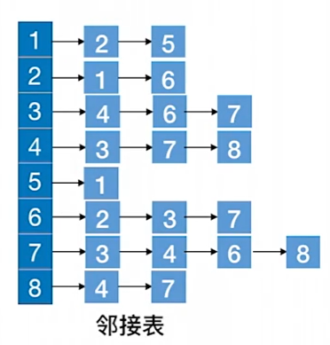
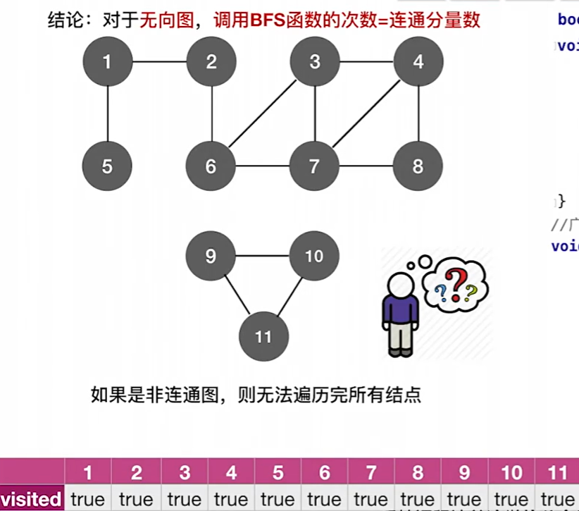
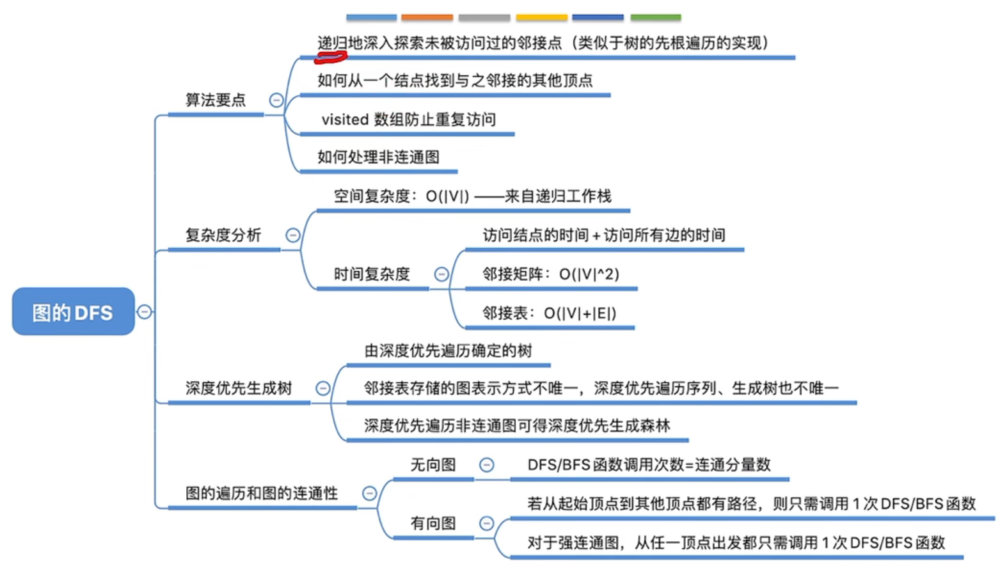
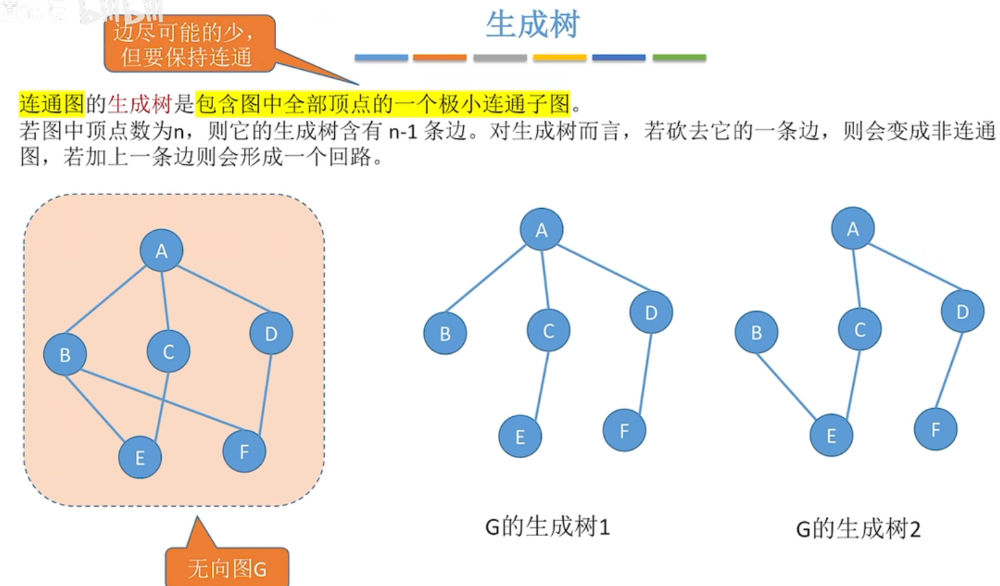

# 图
## 图的表示形式

对于这样一个图，常见的表示形式有如下两种：
### 邻接矩阵(adjacent matrix)

访问$|V|$个顶点需要$O(|V|)$的时间
查找每个顶点的邻接点都需要$O(|V|)$的时间，而总共有$|V|$个顶点，所以访问所有边的时间复杂度$=O(|V|^2)$
总的时间复杂度$=O(|V|)+O(|V|^2)=O(|V|^2)$
*缺点：矩阵稀疏时很浪费空间*
*代码实现：*
```cpp
typedef int Vertex;
class Graph{
  public:
    Graph(int num){
        num_vertices = num;
        edge = new int*[num_vertices];
        vertexTable = new Vertex[num_vertices];
    }
    ~Graph(){ delete[]vertexTable; delete[]edge; }
  private:
    int num_vertices; //顶点数量
    int **edge;   //邻接矩阵，表示点与点之间是否存在边，有权图中可以当作权值
    Vertex *vertexTable;   //顶点表
};
```

### 邻接表(adjacent list)

访问各个顶点需要$O(|V|)$的时间
有向图查找各个顶点的邻接点共需要$O(|E|)$的时间,无向图则翻倍
总的时间复杂度$=O(|V|+|E|)$
*缺点：不方便找入边和计算入度*
*代码实现：*
```cpp
typedef struct Adjacent_node{
    int dest;  //此邻接(目标)顶点在顶点表中的下标,不能直接使用顶点类，否则会死循环
    int cost;  //顶点与此邻接顶点形成的边上的权值
    Adjacent_node *next;   //下一个邻接顶点
    Adjacent_node(int destination,int weight):dest(destination),cost(weight),next(nullptr){}
} Edge;   //主流命名是“Edge”

struct Vertex{
    int data;    //顶点数据域
    Adjacent_node *first;   //随便一个邻接结点作为边链表头结点
};

class Graph{
  public:
    Graph(int num){
        num_vertices = num;
        num_edges= 0; 
        vertexTable = new Vertex[num_vertices];
    }
    ~Graph(){ delete[]vertexTable; }
  private:
    int num_edges,num_vertices;  //顶点数量、边数量
    Vertex *vertexTable;   //顶点表
};
```
## 图的遍历
### 广度优先遍历(BFS)

添加访问标记数组，可以遍历非连通图
```cpp
bool visited[MaxNumVertex];   //访问标记数组

void BFSTraverse(Graph G) {   //对图G进行广度优先遍历
    for (int i=1; i<=G.num_vertices; ++i) {
        visited[i] = false;   //访问标记数组初始化
    InitQueue(Q);   //初始化辅助队列Q
    for(int i=1; i<=G.num_vertices; ++i)  //从1号顶点开始遍历，遍历过就标记
        if(!visited[i])   //对每个连通分量调用一次BFS,防止多个连通分量之间不连通，永远无法遍历到
            BFS(G,i);   //vi未访问过，从vi开始BFS
    }
}
//广度优先遍历
void BFS(Graph G,int v) {//从顶点v出发，广度优先遍历图G
    visit(v);     //访问初始顶点v
    visited[v]=TRUE;    //对v做已访问标记
    Enqueue(Q,v);    //顶点v入队列Q
    while (!isEmpty(Q)) {
        DeQueue(Q,v);     //顶点v出队列
        for(w=G.FirstNeighbor(v) ; w>=0 ; w=G.NextNeighbor(v,w)){  //检测v所有邻接点
            if(!visited[w]){      //w为v的尚未访问的邻接顶点
                visit(w);  //访问顶点w
                visited[w] = true;  //对w做已访问标记
                EnQueue(Q,w);  //顶点w入队列
            }
        }
    }
}
```
#### 广度优先生成树
连通图按广度优先遍历顺序生成一颗树，若图不连通，则可生成森林

### 深度优先遍历(DFS)
```cpp
bool visited[MaxNumVertex];   //访问标记数组

void DFSTraverse(Graph G){   //对图G进行深度优先遍历
    for(int v=1; v<=G.num_vertices; ++v)
        visited[v]=false;  //初始化已访问标记数据
    for(int v=1; v<=G.num_vertices; ++v)
        if(!visited[v])
            DFS(G,v);
}  //这个函数同样是为了防止出现非连通图

void DFS(Graph G,int v){   //从顶点v出发，深度优先遍历图G
    visit(v);   //访问顶点v
    visited[v] = true;  //设已访问标记
    for(int w=G.FirstNeighbor(v); w>=0; w=G.NextNeighor(v,w))
        if(!visited[w]){   // w为v的尚未访问的邻接顶点
            DFS(G,w);
        }
}
```
对上图进行深度优先遍历，若从2出发，则序列为: 2，1，5，6，3，4，7，8，9，10，11
空间复杂度取决于递归深度，最坏为$O(|V|)$，最好为$O(2)$，最好的情况即其他点围着一个起点。

同一个图的邻接矩阵表示方式*唯一*，因此深度优先遍历序列*唯一*，深度优先生成树也*唯一*。
同一个图邻接表表示方式*不唯一*，因此深度优先遍历序列*不唯一*，深度优先生成树也*不唯一*。
#### 深度优先生成树
定义同BFS，非连通图时生成森林

### 阶段总结
#### 无向图
对无向图进行BFS/DFS遍历，调用BFS/DFS函数的次数=连通分量数
对于连通图，只需调用1次BFS/DFS
#### 有向图

#### 思维导图


## 最小生成树(最小代价树)(Minimum-Spanning-Tree,MST)

+ 非连通图不会产生生成树，只产生生成森林
+ 如果一个连通图本身就是一棵树，则其最小生成树就是它本身
+ 最小生成树*可能不唯一*，但总权值唯一且最小
+ $边数 = 顶点树 - 1$
+ 所以研究对象为**带权连通无向图**
### Prim算法(普里姆)
+ **从某一个顶点开始构建生成树**
+ **每次将靠近*当前生成树*的代价最小的新顶点纳入，直到所有顶点都纳入为止。**
+ 时间复杂度$O(|V|^2)$，适合用于边稠密的图

<figure>图中从农场开始，依次是农场、电站、P城、学校、矿场或渔村......</figure>

#### 算法实现

+ 对于这样一个图，准备两个数组，`isJoin`和`lowCost`，初始化如下图
+ 每轮结束后检测*新结点*有没有*带来更小的边*，更新*还没加入生成树*的顶点的`lowCost`，然后接着选择cost最小的新顶点加入

### Kruskal算法(克鲁斯卡尔)
+ **每次选择一条权值最小的边，使这条边的两头连通(若两头已经连通可以互相到达，就不选，去选次小的边)**
+ **直到所有结点都连通**
+ 时间复杂度$O(|E|log_2|E|)$，适合用于边稀疏的图